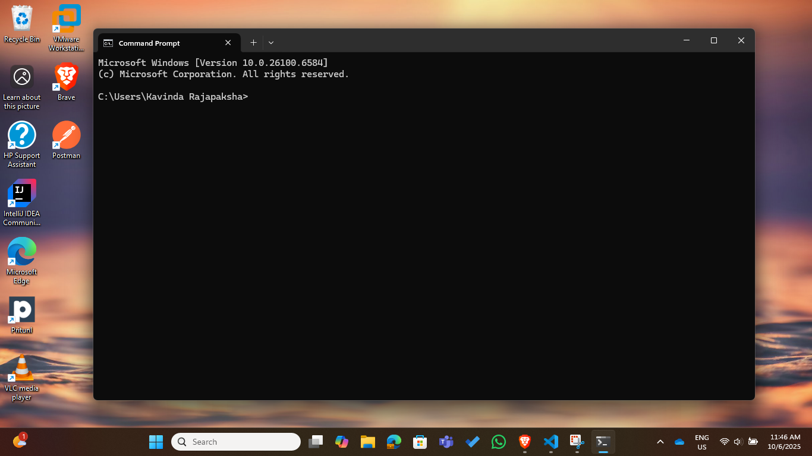

### Useful interfaces in Windows.

#### These interfaces can be used to troubleshoot errors.

- Command Prompt

- System App

- Task Manager

- Resource Monitor

- Performance Monitor

- Control Panel

- Device Manager

- Services

- Event Viewer

